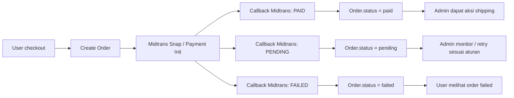

# TODO_Proses.md

Diagram proses sistem (workflow) project **RAFF Kue Basah & Catering** (Laravel + Midtrans + Admin Panel)

---

## 1) Alur Utama Pemesanan (User → Order → Payment → Shipping)

```mermaid
flowchart TD
  A[Landing / Menu Produk] --> B[Keranjang / Detail Pesanan]
  B --> C[Checkout]
  C --> D{Pilih Alamat + Data Pesanan}
  D --> E[Submit Pemesanan]

  E --> F[PesananController: buat Order (status awal)]
  F --> G[Order Disimpan ke DB]

  G --> H[PaymentController: inisialisasi pembayaran Midtrans]
  H --> I{Midtrans callback / redirect}

  I -->|Berhasil| J[Update Order: status paid + simpan midtrans_transaction_id]
  I -->|Pending| K[Update Order: status pending]
  I -->|Gagal| L[Update Order: status failed]

  J --> M[Admin Dashboard: lihat order paid]
  M --> N[Admin: proses pengiriman (shipping)]
  N --> O[Update Order: status shipped/packed/delivered]

  O --> P[Landing: tracking detail pesanan]
```

---

## 2) Jalur Status Pembayaran (Detail)



---

## 3) Jalur Refund (User Request → Admin Approval/Reject → Update Order + Notifikasi)

```mermaid
flowchart TD
  A[User membuka detail order] --> B{Ajukan refund?}
  B -->|Ya| C[User: request refund]
  C --> D[Generate request refund + kirim email
  (RefundRequestMail)]
  C --> E[Store data refund di tabel Order]
  E --> F[AdminNotification: buat notifikasi refund]

  F --> G[Admin membuka halaman notifications/refund]
  G --> H{Admin approve?}
  H -->|Approve| I[Update Order: refund_status = approved]
  H -->|Reject| J[Update Order: refund_status = rejected]

  I --> K[User melihat status refund approved]
  J --> L[User melihat status refund rejected]
```

---

## 4) Notifikasi Admin (AdminNotification + Controller)

```mermaid
flowchart TD
  A[Peristiwa sistem]
  A --> B[Payment status berubah (paid/pending/failed)]
  A --> C[Refund request masuk]
  A --> D[Shipping diproses]

  B --> E[AdminNotification dibuat]
  C --> E
  D --> E

  E --> F[AdminNotificationController: read & tampilkan]
  F --> G[Admin menindak lanjuti]
```

---

## 5) Peta Komponen (Ringkas) dalam Project

- **User (Landing)**
  - `resources/views/landing/checkout.blade.php`
  - `resources/views/landing/pesanan.blade.php`
  - `resources/views/landing/detail_pesanan.blade.php`

- **Controller utama**
  - `app/Http/Controllers/PesananController.php` (pembuatan order / alur pesanan)
  - `app/Http/Controllers/PaymentController.php` (inisialisasi & callback Midtrans)

- **Midtrans**
  - Integrasi via config: `config/midtrans.php`
  - Simpan transaksi: `orders.midtrans_transaction_id`

- **Shipping (Admin)**
  - `resources/views/admin/shipping.blade.php`

- **Refund**
  - Email refund: `app/Mail/RefundRequestMail.php`
  - Email template: `resources/views/emails/refund-request.blade.php`

- **Notifikasi Admin**
  - Model: `app/Models/AdminNotification.php`
  - Controller: `app/Http/Controllers/Admin/AdminNotificationController.php`
  - Views: `resources/views/admin/notifications.blade.php`

---

## 6) Status yang Direkomendasikan (Untuk konsistensi diagram)

> Sesuaikan dengan nilai aktual di kolom `orders` pada migration.

- `pending` (menunggu pembayaran)
- `paid` (dibayar sukses)
- `failed` (gagal)
- `shipped` / `packed` / `delivered` (tahap pengiriman)
- `refund_requested` / `refund_approved` / `refund_rejected` (jalur refund)

---

## 7) Catatan Penggunaan

- Diagram memakai alur logis: **redirect user → callback Midtrans → update order → admin proses shipping**.
- Jalur refund memanfaatkan kombinasi **database (refund fields di Order)** + **email** + **notifikasi admin**.

---

## DONE Checklist (TODO internal dokumentasi)
- [x] Diagram utama pemesanan & pembayaran
- [x] Diagram status payment (paid/pending/failed)
- [x] Diagram refund request & admin action
- [x] Diagram notifikasi admin berbasis event
- [ ] Sinkronkan label status persis dengan field/enum di DB (opsional)

